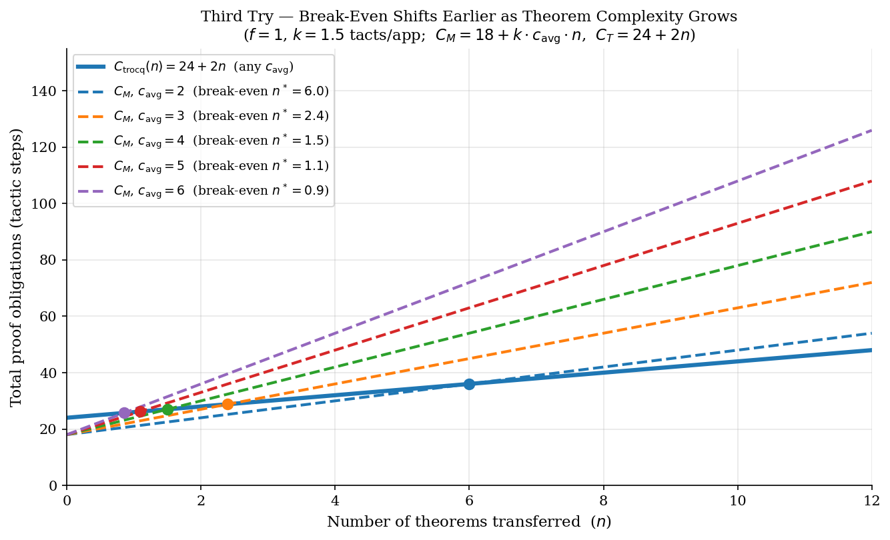

<!-- _class: title -->
<!-- _paginate: false -->

# ROI Analysis: Proof Transfer with Trocq

### Three iterative approaches to measuring when Trocq pays off

---

## Setting the Scene

We want to measure the **Return on Investment** of using Trocq to transfer theorems between equivalent types.

**The experimental setup:**

| File | Role |
|------|------|
| `bs_p1.v` | `NatList` — monomorphic list; base theorems (`nlength_napp`, …) |
| `bs_p2.v` | `PList nat` — polymorphic list; functions (`plength`, `papp`) |
| `bs_p4.v` | **Manual** proof transfer: explicit bijections + rewrite scripts |
| `bs_p5.v` | **Trocq** proof transfer: relational witnesses + `trocq.` tactic |
| `bs_p6.v` | Extended experiment adding `rev` — the key complexity benchmark |

**What we measure:** *proof obligations* — the number of tactic steps required.

> **Goal:** find the break-even point and understand *when* Trocq pays off.

---

<!-- _class: chapter -->
<!-- _paginate: false -->

# First Try

*A clean model. Too clean.*

---

## First Try — Variables & Cost Formulas

**Independent variables:**

| Symbol | Meaning |
|--------|---------|
| $n$ | Number of theorems to transfer |
| $c$ | Theorem complexity (distinct functions/constructors) |
| $d$ | Type distance: Param class (44 = iso → $d=1$; lower class → $d>1$) |

**Proposed cost formulas:**

$$C_{\text{manual}}(n, c) = 7cn$$

$$C_{\text{trocq}}(n, c, d) = \underbrace{(12d + 5)}_{\text{one-time setup}} + \underbrace{2cn}_{\text{per theorem}}$$

> **Key assumption:** the manual approach has **no fixed cost** — every obligation scales with $n$.

---

## First Try — Break-Even & ROI

Setting $C_{\text{manual}} = C_{\text{trocq}}$ with $c = 1,\ d = 1$:

$$7n = 17 + 2n \implies n^* = \frac{17}{5} \approx 3.4 \text{ theorems}$$

**ROI formula** (savings relative to Trocq's own cost):

$$\text{ROI}(n) = \frac{C_{\text{manual}}(n) - C_{\text{trocq}}(n)}{C_{\text{trocq}}(n)} = \frac{5n - 17}{17 + 2n}$$

| Region | Interpretation |
|--------|---------------|
| $\text{ROI} < 0$ for $n < 3.4$ | Manual is cheaper — Trocq overhead not yet amortized |
| $\text{ROI} = 0$ at $n \approx 4$ | Break-even point |
| $\text{ROI} \to 2.5$ as $n \to \infty$ | Trocq saves 2.5× its own cost |

---

## First Try — Cost Graph


The manual line ($7n$) passes through the origin; Trocq starts at 17 (fixed setup) but rises more slowly.

---

## First Try — ROI Curve


The curve starts at $-1$ (Trocq costs 2× at $n=0$), crosses zero at $n \approx 3.4$, then asymptotes to $2.5$.

---

## First Try — Problems

**Flaw:** $C_{\text{manual}} = 7cn$ assumes every obligation scales with each new theorem.

But `bs_p4.v` shows the isomorphisms and bridge lemmas are written **exactly once**:

```coq
(* FIXED SETUP in bs_p4.v — written once, not per theorem *)
Lemma plist_natlist_iso  : natlist_to_plist (plist_to_natlist l) = l.
Lemma natlist_plist_iso  : plist_to_natlist (natlist_to_plist l) = l.
Lemma plength_eq_nlength : nlength (plist_to_natlist l) = plength l.
Lemma plist_to_natlist_app : plist_to_natlist (papp l1 l2) =
    napp (plist_to_natlist l1) (plist_to_natlist l2).
```

And `bs_p5.v` shows Trocq **also requires** those same bridge lemmas:

```coq
(* bs_p5.v — Trocq still needs the same bridges *)
Lemma _plength_eq_nlength : forall (l : _PList),
    _plength l = nlength (plist_2_nlist l).   (* ← identical to manual *)

Lemma plist_2_nlist_app : forall (l1 l2 : _PList),
    plist_2_nlist (_papp l1 l2) =
    napp (plist_2_nlist l1) (plist_2_nlist l2).
```

**Conclusion:** both the manual fixed cost and the Trocq base cost were misrepresented.

---

<!-- _class: chapter -->
<!-- _paginate: false -->

# Second Try

*Separating fixed setup from per-theorem cost.*

---

## Second Try — Code Evidence: Manual (`bs_p4.v`)

The manual approach has a **fixed setup** (paid once) plus a **per-theorem rewrite script**:

```coq
(* ── SHARED SETUP — paid once, regardless of how many theorems ─────── *)
Lemma plist_natlist_iso     : natlist_to_plist (plist_to_natlist l) = l.
Lemma natlist_plist_iso     : plist_to_natlist (natlist_to_plist l) = l.
Lemma plength_eq_nlength    : nlength (plist_to_natlist l) = plength l.
Lemma plist_to_natlist_app  : plist_to_natlist (papp l1 l2) = napp (...) (...).

(* ── PER-THEOREM SCRIPT — a new rewrite chain for each theorem ──────── *)
Theorem plength_papp_via_natlist : forall (l1 l2 : PList nat),
    plength (papp l1 l2) = plength l1 + plength l2.
Proof.
    intros l1 l2.                                           (* step 1 *)
    rewrite <- (plength_eq_nlength (papp l1 l2)).           (* step 2 *)
    rewrite plist_to_natlist_app.                           (* step 3 *)
    rewrite nlength_napp.                                   (* step 4 *)
    rewrite plength_eq_nlength. rewrite plength_eq_nlength. (* 5–6 *)
    reflexivity.                                            (* step 7 *)
Qed.  (* ~7 tactic steps per theorem *)
```

---

## Second Try — Code Evidence: Trocq (`bs_p5.v`)

Trocq requires the **same bridge lemmas** plus **relational wrappers** for each function:

```coq
(* ── BASE SETUP — same bridges as manual ───────────────────────────── *)
Lemma _plength_eq_nlength : ...   Lemma plist_2_nlist_app : ...

(* ── TROCQ OVERHEAD — one R__ lemma per function + registrations ───── *)
Lemma R__plength                                  (* relational witness for plength *)
    (l : _PList) (l' : NatList) (lR : rel R_NatList l l') :
    natR (_plength l) (nlength l').               (* ~5 extra tactic steps *)

Lemma R__papp                             (* relational witness for papp *)
    (l1 : _PList) (l1' : NatList) (l1R : rel R_NatList l1 l1')
    (l2 : _PList) (l2' : NatList) (l2R : rel R_NatList l2 l2') :
    rel R_NatList (_papp l1 l2) (napp l1' l2').   (* ~7 extra tactic steps *)

Trocq Use R_NatList.    Trocq Use R__plength.   Trocq Use R__papp.
Trocq Use Param44_nat.  Trocq Use Param_add.      (* 5 registrations *)

(* ── PER-THEOREM COST — just 2 tactics ─────────────────────────────── *)
Theorem _plength_papp : forall (l1 l2 : _PList),
    _plength (_papp l1 l2) = _plength l1 + _plength l2.
Proof.  trocq.  apply nlength_napp.  Qed.
```

---

## Second Try — Revised Formulas

Let $f$ = number of distinct functions/constructors in the theory.

**Shared base setup (paid by both approaches):**

$$C_{\text{base}}(f) = S_{\text{iso}} + f \cdot S_{\text{bridge}}$$

**Manual total cost:**

$$C_{\text{manual}}(n, f) = C_{\text{base}}(f) + n \cdot P_{\text{manual}}$$

**Trocq total cost:**

$$C_{\text{trocq}}(n, f) = C_{\text{base}}(f) + \underbrace{f \cdot W_{\text{trocq}}}_{\text{wrapper penalty}} + n \cdot 2$$

| Factor | Value (bs_p5, $f=2$) |
|--------|----------------------|
| $C_{\text{base}}$ | ≈ 12 shared tactic steps |
| $f \cdot W_{\text{trocq}}$ | ≈ 22 (R__ wrappers + Trocq Use) |
| $P_{\text{manual}}$ | ≈ 7 tactic steps per theorem |

**Key insight:** Trocq's *intercept* is higher, but its *slope* is much lower.

---

## Second Try — Revised Cost Graph


Trocq starts more expensive ($34$ vs $12$ at $n=0$) but overtakes manual at $n^* \approx 4.4$.

---

## Second Try Insights


The ROI formula converges to a **finite constant** as $n \to \infty$:

$$\text{ROI}(n) = \frac{C_{\text{manual}}(n) - C_{\text{trocq}}(n)}{C_{\text{trocq}}(n)} \xrightarrow{\ n \to \infty\ } \frac{P_{\text{manual}} - 2}{2} = \text{const}$$

For $P_{\text{manual}} = 7$: ROI $\to 2.5$ — a bounded **2.5× return**.


---

<!-- _class: chapter -->
<!-- _paginate: false -->

# Third Try

*Introducing theorem complexity as a multiplier.*

---

## Third Try — Code Comparison (`bs_p6.v`)

Adding `rev` reveals the core asymmetry: manual cost **scales with theorem complexity**, Trocq does not.

<div class="cols">

**Manual — 9 tactic steps:**
```coq
Theorem _prev_papp_manual : _prev (_papp l1 l2) = _papp (_prev l2) (_prev l1).
Proof.
  intros l1 l2.
  rewrite <- (plist_nlist_iso (_prev (_papp l1 l2))).         (* 1 *)
  rewrite <- (plist_nlist_iso (_papp (_prev l2) (_prev l1))). (* 2 *)
  apply f_equal.                                              (* 3 *)
  rewrite plist_2_nlist_rev.                                  (* 4 *)
  rewrite plist_2_nlist_app.                                  (* 5 *)
  rewrite nrev_napp.                                          (* 6 *)
  rewrite plist_2_nlist_app.                                  (* 7 *)
  rewrite plist_2_nlist_rev.                                  (* 8 *)
  rewrite plist_2_nlist_rev.                                  (* 9 *)
  reflexivity.
Qed.
```

**Trocq — 2 tactic steps:**
```coq
Theorem _prev_papp_trocq : _prev (_papp l1 l2) = _papp (_prev l2) (_prev l1).
Proof.
  trocq.                                                      (* 1 *)
  apply nrev_napp.                                            (* 2 *)
Qed.
```

</div>

The theorem has **5 function applications** (`_prev` ×3, `_papp` ×2).

Every application adds ~1.5 manual tactics; Trocq is unaffected by this complexity.

---

## Third Try — Refined Variables & Formulas

Introduce $c_{\text{avg}} = \text{average}$ number of function applications per theorem.

**Manual cost:**

$$C_{\text{manual}}(n, f, c_{\text{avg}}) = C_{\text{base}}(f) + n \cdot (k \cdot c_{\text{avg}})$$

**Trocq cost:**

$$C_{\text{trocq}}(n, f) = C_{\text{base}}(f) + f \cdot W_{\text{trocq}} + n \cdot 2$$

> $c_{\text{avg}}$ **does not appear** in the Trocq formula — Trocq is complexity-blind.

**Ultimate ROI:**

$$\text{ROI}(n, f, c_{\text{avg}}) = \frac{n(k \cdot c_{\text{avg}} - 2) - f \cdot W_{\text{trocq}}}{C_{\text{base}}(f) + f \cdot W_{\text{trocq}} + 2n}$$

**From `bs_p6.v`** ($f=1$, $k=1.5$, $c_{\text{avg}}=5$, manual bridge costs 5, Trocq setup costs 11):

$$C_M = 18 + 9n \qquad C_T = 24 + 2n \qquad n^* = \frac{6}{7} \approx 0.86$$

Trocq is cheaper from the **very first theorem**.

---

## Third Try — Three Insights

1. **The Single Monster Theorem**

    Because $c_{\text{avg}}$ multiplies $n$, a **single complex theorem** (large $c_{\text{avg}}$, $n=1$) can instantly make Trocq profitable.
    
    Manually proving a theorem with 50 nested calls would require ~75 rewrites; Trocq still takes exactly 2 lines.

2. **The Broad Vocabulary Trap**

    The penalty $f \cdot W_{\text{trocq}}$ grows with the **vocabulary size** $f$.
    
    If a theory has 100 functions but you only transfer 1 simple theorem ($n=1$, $c_{\text{avg}}=2$), Trocq forces you to write 100 relational wrappers (`R__f`) for functions you barely use — a poor investment.

3. **The Asymptote**

    As $n \to \infty$, fixed costs become negligible. ROI converges to     $\text{ROI}_\infty = \frac{k \cdot c_{\text{avg}} - 2}{2}$.

    For $k = 1.5$, $c_{\text{avg}} = 6$: $\text{ROI}_\infty = \frac{9 - 2}{2} = 3.5$.

    Trocq returns **350% on its setup investment** — i.e., manual becomes 4.5× more expensive.

---

## Third Try — Break-Even Shifts with Complexity



Each dashed curve is $C_M(n, c_{\text{avg}})$ for a different complexity. The solid Trocq line is fixed. Dots mark break-even points — they shift left as theorems grow more complex.

---

## Conclusion — When Does Trocq Pay Off?

| Scenario | Winner | Key factor |
|----------|--------|-----------|
| Few theorems ($n < 4$), simple goals | **Manual** | Trocq setup overhead not yet amortized |
| Many theorems ($n \geq 4$), any complexity | **Trocq** | Per-theorem savings accumulate |
| Single complex theorem ($c_{\text{avg}} \geq 5$, $n=1$) | **Trocq** | Complexity $c_{\text{avg}}$ dominates immediately |
| Large vocabulary ($f \gg 1$), few theorems | **Manual** | Wrapper cost $f \cdot W_{\text{trocq}}$ exceeds savings |
| Growing library ($n \to \infty$) | **Trocq** | ROI $\to \dfrac{k \cdot c_{\text{avg}} - 2}{2}$ |

**The three tipping factors:** $n$ (volume), $c_{\text{avg}}$ (complexity), $f$ (vocabulary size).

> Trocq shines when theorems are **numerous** or **complex** over a **small shared vocabulary**.
> Manual is competitive only in early-stage, small-vocabulary, simple-goal scenarios.
