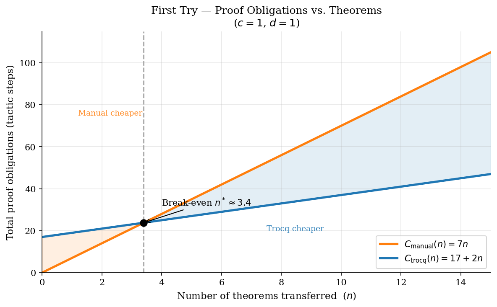
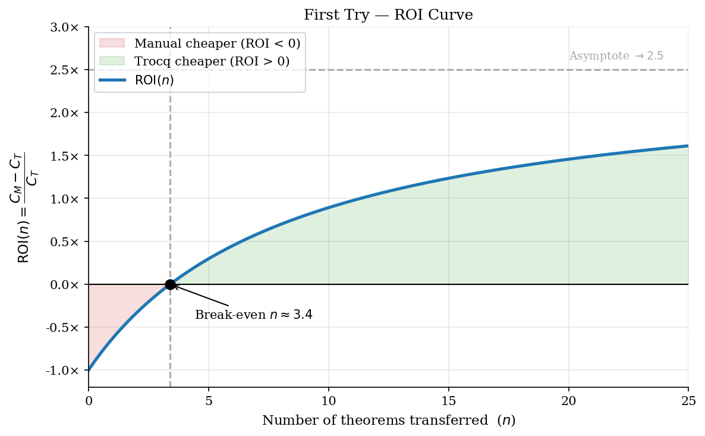
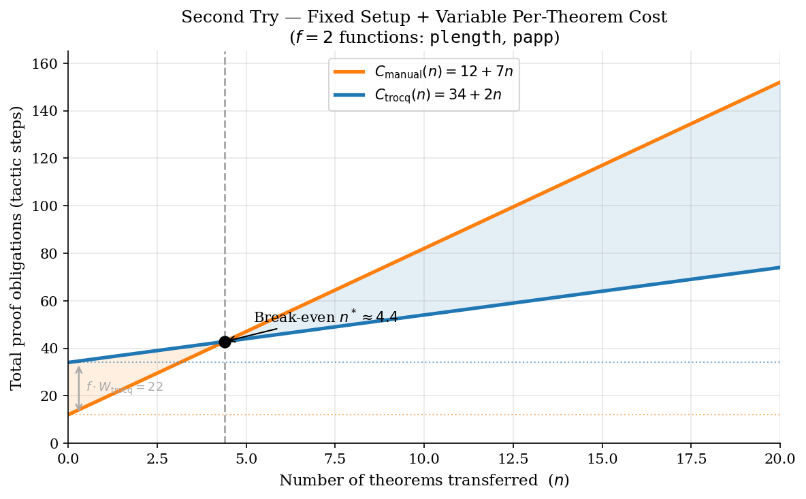
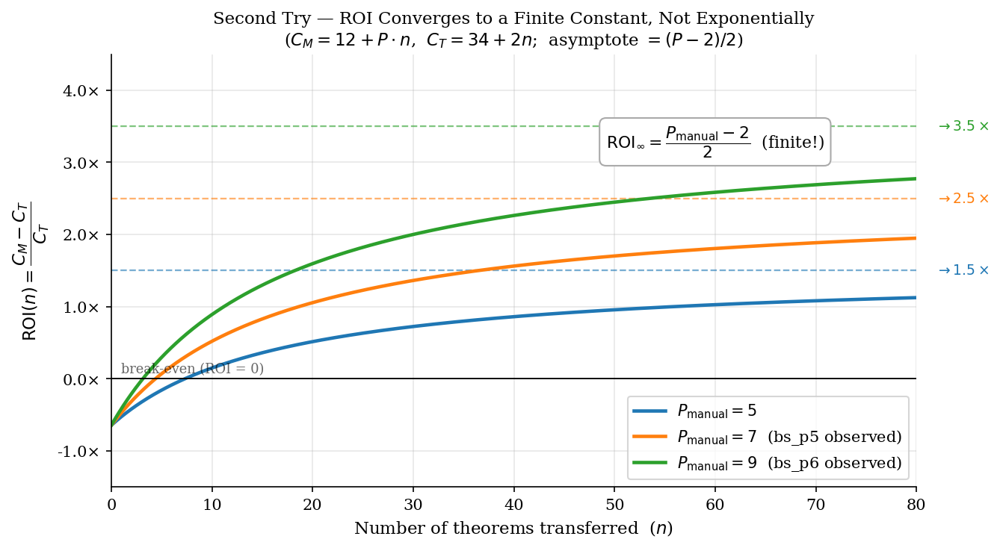
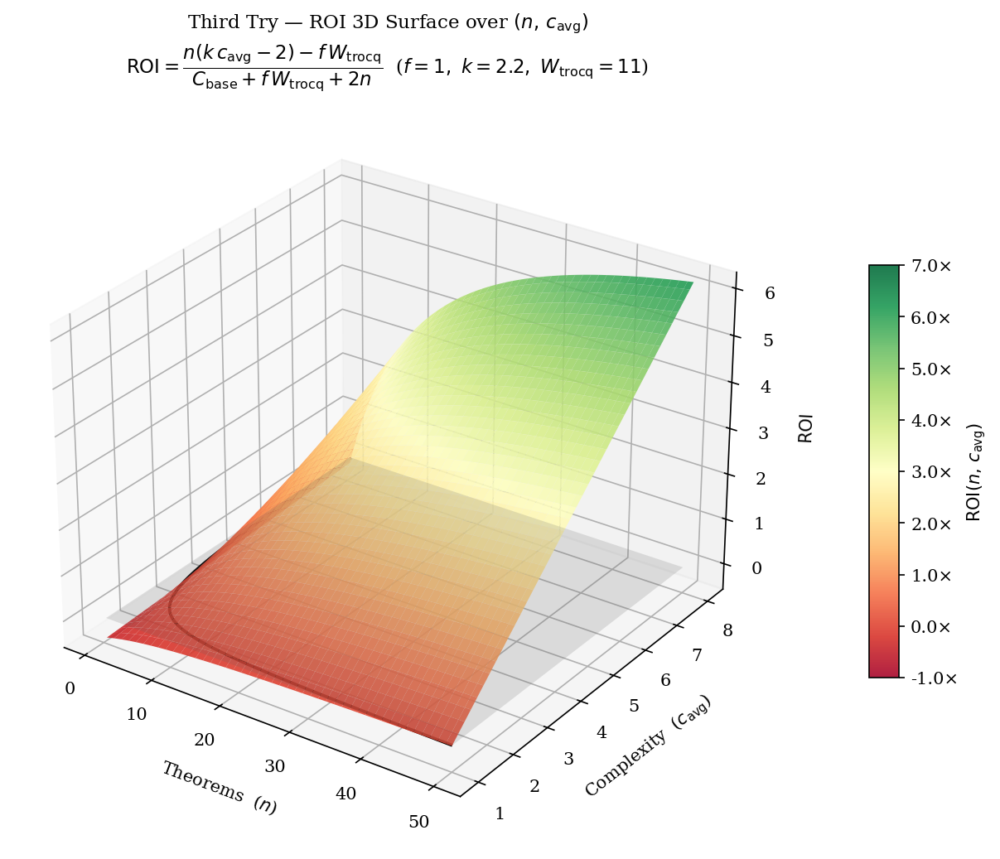
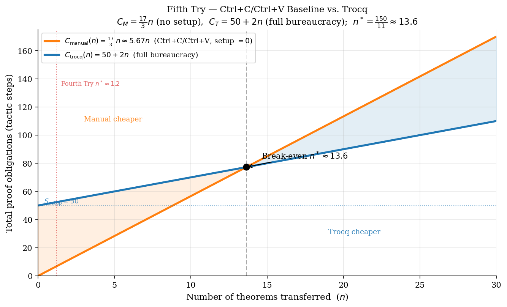

<!-- _class: title -->
<!-- _paginate: false -->

# ROI Analysis: Proof Transfer with Trocq

### Three iterative approaches to measuring when Trocq pays off

---

## Setting the Scene

We want to measure the **Return on Investment** of using Trocq to transfer theorems between equivalent types.

**The experimental setup:**

| File | Role |
|------|------|
| `bs_p1.v` | `NatList` — monomorphic list; base theorems (`nlength_napp`, …) |
| `bs_p2.v` | `PList nat` — polymorphic list; functions (`plength`, `papp`) |
| `bs_p4.v` | **Manual** proof transfer: explicit bijections + rewrite scripts |
| `bs_p5.v` | **Trocq** proof transfer: relational witnesses + `trocq.` tactic |
| `bs_p6.v` | Extended experiment adding `rev` — the key complexity benchmark |
| `bs_p7.v` | **Validation** experiment adding `sum` — confirms break-even at $n \approx 2$ |

**What we measure:** *proof obligations* — the number of tactic steps required.

> **Goal:** find the break-even point and understand *when* Trocq pays off.

---

<!-- _class: chapter -->
<!-- _paginate: false -->

# First Try

*A clean model. Too clean.*

---

## First Try — Variables & Cost Formulas

**Independent variables:**

| Symbol | Meaning |
|--------|---------|
| $n$ | Number of theorems to transfer |
| $c$ | Theorem complexity (distinct functions/constructors) |
| $d$ | Type distance: Param class (44 = iso → $d=1$; lower class → $d>1$) |

**Proposed cost formulas:**

$$C_{\text{manual}}(n, c) = 7cn$$

$$C_{\text{trocq}}(n, c, d) = \underbrace{(12d + 5)}_{\text{one-time setup}} + \underbrace{2cn}_{\text{per theorem}}$$

| Constant | Meaning |
|----------|---------|
| $7$ | Estimated tactic steps per theorem per function (rewrite chain) |
| $12$ | Relational-witness cost per unit of type distance |
| $5$ | Number of `Trocq Use` registrations |
| $2$ | Per-theorem Trocq cost (`trocq.` + `apply`) |

> **Key assumption:** the manual approach has **no fixed cost** — every obligation scales with $n$.

---

## First Try — Break-Even & ROI

Setting $C_{\text{manual}} = C_{\text{trocq}}$ with $c = 1,\ d = 1$:

$$7n = 17 + 2n \implies n^* = \frac{17}{5} \approx 3.4 \text{ theorems}$$

**ROI formula** (savings relative to Trocq's own cost):

$$\text{ROI}(n) = \frac{C_{\text{manual}}(n) - C_{\text{trocq}}(n)}{C_{\text{trocq}}(n)} = \frac{\overbrace{(7-2)}^{\text{per-thm slope diff}} \cdot n - \overbrace{17}^{C_{\text{setup}}}}{\underbrace{17}_{C_{\text{setup}}} + \underbrace{2}_{\text{Trocq per-thm}} \cdot n} = \frac{5n - 17}{17 + 2n}$$

*Where $17 = 12d+5$ with $d=1$, and the numerator coefficient $5 = 7c - 2c$ with $c=1$.*

| Region | Interpretation |
|--------|---------------|
| $\text{ROI} < 0$ for $n < 3.4$ | Manual is cheaper — Trocq overhead not yet amortized |
| $\text{ROI} = 0$ at $n \approx 4$ | Break-even point |
| $\text{ROI} \to 2.5$ as $n \to \infty$ | Trocq saves 2.5× its own cost |

---

## First Try — Cost Graph



The manual line ($7n$) passes through the origin; Trocq starts at 17 (fixed setup) but rises more slowly.

---

## First Try — ROI Curve



The curve starts at $-1$ (Trocq costs 2× at $n=0$), crosses zero at $n \approx 3.4$, then asymptotes to $2.5$.

---

## First Try — Problems

**Flaw:** $C_{\text{manual}} = 7cn$ assumes every obligation scales with each new theorem.

But `bs_p4.v` shows the isomorphisms and bridge lemmas are written **exactly once**:

```coq
(* bs_p4.v — written once, not per theorem *)
Lemma plist_natlist_iso    : natlist_to_plist (plist_to_natlist l) = l.
Lemma natlist_plist_iso    : plist_to_natlist (natlist_to_plist l) = l.
Lemma plength_eq_nlength   : nlength (plist_to_natlist l) = plength l.
Lemma plist_to_natlist_app : plist_to_natlist (papp l1 l2) = napp (plist_to_natlist l1) (plist_to_natlist l2).
```

And `bs_p5.v` shows Trocq **also requires** those same bridge lemmas:

```coq
(* bs_p5.v — Trocq still needs the same bridges *)
Lemma _plength_eq_nlength : forall (l : _PList),
    _plength l = nlength (plist_2_nlist l).           (* identical to manual *)

Lemma plist_2_nlist_app : forall (l1 l2 : _PList),
    plist_2_nlist (_papp l1 l2) = napp (plist_2_nlist l1) (plist_2_nlist l2).
```

**Conclusion:** both the manual fixed cost and the Trocq base cost were misrepresented.

---

<!-- _class: chapter -->
<!-- _paginate: false -->

# Second Try

*Separating fixed setup from per-theorem cost.*

---

## Second Try — Code Evidence: Manual (`bs_p4.v`)

The manual approach has a **fixed setup** (paid once) plus a **per-theorem rewrite script**:

```coq
(* ── SHARED SETUP — paid once, regardless of how many theorems ─────── *)
Lemma plist_natlist_iso     : natlist_to_plist (plist_to_natlist l) = l.
Lemma natlist_plist_iso     : plist_to_natlist (natlist_to_plist l) = l.
Lemma plength_eq_nlength    : nlength (plist_to_natlist l) = plength l.
Lemma plist_to_natlist_app  : plist_to_natlist (papp l1 l2) = napp (...) (...).

(* ── PER-THEOREM SCRIPT — a new rewrite chain for each theorem ──────── *)
Theorem plength_papp_via_natlist : forall (l1 l2 : PList nat),
    plength (papp l1 l2) = plength l1 + plength l2.
Proof.
    intros l1 l2.                                  (* 1 *)
    rewrite <- (plength_eq_nlength (papp l1 l2)).  (* 2 *)
    rewrite plist_to_natlist_app.                  (* 3 *)
    rewrite nlength_napp.                          (* 4 *)
    rewrite plength_eq_nlength.                    (* 5 *)
    rewrite plength_eq_nlength.                    (* 6 *)
    reflexivity.                                   (* 7 *)
Qed.
```

---

## Second Try — Code Evidence: Trocq (`bs_p5.v`)

Trocq requires the **same bridge lemmas** plus **relational wrappers** for each function:

```coq
(* ── BASE SETUP — same bridges as manual ───────────────────────────── *)
Lemma _plength_eq_nlength : ...   Lemma plist_2_nlist_app : ...

(* ── TROCQ OVERHEAD — one R__ lemma per function + registrations ───── *)
Lemma R__plength (* relational witness for plength *)
    (l : _PList) (l' : NatList) (lR : rel R_NatList l l') :
    natR (_plength l) (nlength l').               
    (* ~5 extra tactic steps *)

Lemma R__papp (* relational witness for papp *)
    (l1 : _PList) (l1' : NatList) (l1R : rel R_NatList l1 l1')
    (l2 : _PList) (l2' : NatList) (l2R : rel R_NatList l2 l2') :
    rel R_NatList (_papp l1 l2) (napp l1' l2').
    (* ~7 extra tactic steps *)

(* 5 registrations *)
Trocq Use R_NatList.    Trocq Use R__plength.   Trocq Use R__papp.
Trocq Use Param44_nat.  Trocq Use Param_add.      

(* ── PER-THEOREM COST — just 2 tactics ─────────────────────────────── *)
Theorem _plength_papp : forall (l1 l2 : _PList),
  _plength (_papp l1 l2) = _plength l1 + _plength l2.
Proof.
  trocq.
  apply nlength_napp.
Qed.
```

---

## Second Try — Revised Formulas

Let $f$ = number of distinct functions/constructors in the theory.

**Shared base setup (paid by both approaches):** $C_{\text{base}}(f) = S_{\text{iso}} + f \cdot S_{\text{bridge}}$

**Manual total cost:** $C_{\text{manual}}(n, f) = C_{\text{base}}(f) + n \cdot P_{\text{manual}}$

**Trocq total cost:** $C_{\text{trocq}}(n, f) = C_{\text{base}}(f) + \underbrace{f \cdot W_{\text{trocq}}}_{\text{wrapper penalty}} + n \cdot 2$

| Symbol | Meaning | Value (`bs_p5.v`, $f=2$) |
|--------|---------|------------------------|
| $S_{\text{iso}}$ | Steps to prove type bijections (shared) | ≈ 6 |
| $S_{\text{bridge}}$ | Steps per bridge lemma (`plist_2_nlist_app`, etc.) | ≈ 3 |
| $C_{\text{base}}$ | $S_{\text{iso}} + f \cdot S_{\text{bridge}}$ total shared steps | ≈ 12 |
| $W_{\text{trocq}}$ | Steps for one `R__` relational wrapper + `Trocq Use` | ≈ 6 |
| $f \cdot W_{\text{trocq}}$ | Total Trocq overhead for all $f$ functions | ≈ 22 |
| $P_{\text{manual}}$ | Tactic steps to manually rewrite one theorem | ≈ 7 |
| $2$ | Per-theorem Trocq cost (`trocq.` + `apply`) | 2 |

**Key insight:** Trocq's *intercept* is higher, but its *slope* is much lower.

---

## Second Try — Revised Cost Graph



Trocq starts more expensive ($34$ vs $12$ at $n=0$) but overtakes manual at $n^* \approx 4.4$.

---

## Second Try Insights


The ROI formula converges to a **finite constant** as $n \to \infty$:

$$\text{ROI}(n) = \frac{C_{\text{manual}}(n) - C_{\text{trocq}}(n)}{C_{\text{trocq}}(n)} \xrightarrow{\ n \to \infty\ } \frac{P_{\text{manual}} - 2}{2} = \text{const}$$

*Where $P_{\text{manual}}$ = per-theorem manual tactic count, and $2$ = per-theorem Trocq cost.*

For $P_{\text{manual}} = 7$: ROI $\to 2.5$ — a bounded **2.5× return**.




---

<!-- _class: chapter -->
<!-- _paginate: false -->

# Third Try

*Introducing theorem complexity as a multiplier.*

---

## Third Try — Code Comparison (`bs_p6.v`)

Adding `rev` reveals the core asymmetry: manual cost **scales with theorem complexity**, Trocq does not.

<div class="cols">

**Manual — 11 tactic steps:**
```coq
Theorem _prev_papp_manual : _prev (_papp l1 l2) = _papp (_prev l2) (_prev l1).
Proof.
  intros l1 l2.                                               (*  1 *)
  rewrite <- (plist_nlist_iso (_prev (_papp l1 l2))).         (*  2 *)
  rewrite <- (plist_nlist_iso (_papp (_prev l2) (_prev l1))). (*  3 *)
  apply f_equal.                                              (*  4 *)
  rewrite plist_2_nlist_rev.                                  (*  5 *)
  rewrite plist_2_nlist_app.                                  (*  6 *)
  rewrite nrev_napp.                                          (*  7 *)
  rewrite plist_2_nlist_app.                                  (*  8 *)
  rewrite plist_2_nlist_rev.                                  (*  9 *)
  rewrite plist_2_nlist_rev.                                  (* 10 *)
  reflexivity.                                                (* 11 *)
Qed.
```

**Trocq — 2 tactic steps:**
```coq
Theorem _prev_papp_trocq : _prev (_papp l1 l2) = _papp (_prev l2) (_prev l1).
Proof.
  trocq.                                                      (* 1 *)
  apply nrev_napp.                                            (* 2 *)
Qed.
```

</div>

The theorem has **5 function applications** (`_prev` ×3, `_papp` ×2).
So every application adds $k=2.2$ (11 steps by 5 applications) manual tactics, but Trocq is unaffected by this complexity.

---

## Third Try — Refined Variables & Formulas

Introduce $c_{\text{avg}} = \text{average}$ number of function applications per theorem.

**Manual cost:**
$$C_{\text{manual}}(n, f, c_{\text{avg}}) = C_{\text{base}}(f) + n \cdot (k \cdot c_{\text{avg}})$$

**Trocq cost:**
$$C_{\text{trocq}}(n, f) = C_{\text{base}}(f) + f \cdot W_{\text{trocq}} + n \cdot 2$$

| Symbol | Meaning |
|--------|---------|
| $c_{\text{avg}}$ | Avg. number of function applications per theorem (syntactic complexity) |
| $k$ | Tactic steps per function application in a manual proof ($\approx 2.2$ from `bs_p6.v`) |
| $f$ | Number of distinct functions/constructors in the theory |
| $W_{\text{trocq}}$ | Trocq overhead per function: `R__` relational wrapper + `Trocq Use` ($\approx 6$) |
| $C_{\text{base}}(f)$ | Shared base setup: bijection proofs + $f$ bridge lemmas |
| $2$ | Per-theorem Trocq cost (`trocq.` + `apply`) |

> $c_{\text{avg}}$ **does not appear** in the Trocq formula — Trocq is complexity-blind.

---

## Third Try — Refined Variables & Formulas

**ROI:**

$$\text{ROI}(n, f, c_{\text{avg}}) = \frac{\overbrace{n(k \cdot c_{\text{avg}} - 2)}^{\text{per-thm savings} \times n} - \overbrace{f \cdot W_{\text{trocq}}}^{\text{Trocq wrapper overhead}}}{\underbrace{C_{\text{base}}(f) + f \cdot W_{\text{trocq}}}_{\text{fixed Trocq cost}} + \underbrace{2n}_{\text{variable Trocq cost}}}$$

</br>

**From `bs_p6.v`** ($f=1$, $k=2.2$, $c_{\text{avg}}=5$, manual bridge costs 5, Trocq setup costs 11):

</br>

$$C_M = 18 + 11n \qquad C_T = 24 + 2n \qquad n^* = \frac{24-18}{11-2} = \frac{6}{9} \approx 0.67$$

</br>

Trocq is cheaper from the **very first theorem**.

---

## Third Try — Three Insights

1. **The Single Monster Theorem**

    Because $c_{\text{avg}}$ multiplies $n$, a **single complex theorem** (large $c_{\text{avg}}$, $n=1$) can instantly make Trocq profitable.
    
    Manually proving a theorem with 50 nested calls would require ~75 rewrites; Trocq still takes exactly 2 lines.

2. **The Broad Vocabulary Trap**

    The penalty $f \cdot W_{\text{trocq}}$ grows with the **vocabulary size** $f$.
    
    If a theory has 100 functions but you only transfer 1 simple theorem ($n=1$, $c_{\text{avg}}=2$), Trocq forces you to write 100 relational wrappers (`R__f`) for functions you barely use — a poor investment.

3. **The Asymptote**

    As $n \to \infty$, fixed costs become negligible. ROI converges to     $\text{ROI}_\infty = \frac{k \cdot c_{\text{avg}} - 2}{2}$.

    <!-- 
    With $k = 2.2$ and $c_{\text{avg}} = 6$:
    $$\text{ROI}_\infty = \frac{k \cdot c_{\text{avg}} - 2}{2} = \frac{2.2 \times 6 - 2}{2} = \frac{13.2 - 2}{2} = \frac{11.2}{2} = 5.6$$
    -->
    For $k = 2.2$, $c_{\text{avg}} = 6$: $\text{ROI}_\infty = \dfrac{k \cdot c_{\text{avg}} - 2}{2} = \dfrac{2.2 \times 6 - 2}{2} = 5.6$.

    *Here $k$ = tactic steps per function application in manual proofs, $c_{\text{avg}}$ = avg. function applications per theorem, and $2$ = Trocq's constant per-theorem cost.*

    Trocq returns **560% on its setup investment** — i.e., manual becomes 6.6× more expensive.

---

## Third Try — Break-Even Shifts with Complexity



<!-- Each dashed curve is $C_M(n, c_{\text{avg}})$ for a different complexity. The solid Trocq line is fixed. Dots mark break-even points — they shift left as theorems grow more complex. -->

---

<!-- _class: chapter -->
<!-- _paginate: false -->

# Fourth Experiment: Sum Function

*Validating the model with `bs_p7.v`.*

---

## Fourth Experiment — New Functions (`bs_p7.v`)

`bs_p7.v` adds list-summation to the vocabulary, giving us a second data point for the Third Try model.

<div class="cols">

**`NatList` side:**
```coq
(* Base theorem — 5 tactic steps *)
Theorem nsum_napp : forall (l1 l2 : NatList),
    nsum (napp l1 l2) = nsum l1 + nsum l2.
```

**`_PList` side:**
```coq
(* Bridge lemma — 4 tactic steps *)
Lemma psum_eq_nsum : forall (l : _PList),
    psum l = nsum (plist_2_nlist l).

(* Manual transfer — 7 tactic steps *)
Theorem psum_papp_manual : forall (l1 l2 : _PList),
    psum (_papp l1 l2) = psum l1 + psum l2.
Proof.
  intros l1 l2.              (* 1 *)
  rewrite psum_eq_nsum.      (* 2 *)
  rewrite plist_2_nlist_app. (* 3 *)
  rewrite nsum_napp.         (* 4 *)
  rewrite <- psum_eq_nsum.   (* 5 *)
  rewrite <- psum_eq_nsum.   (* 6 *)
  reflexivity.               (* 7 *)
Qed.

(* Trocq transfer — 2 tactic steps *)
Theorem psum_papp_trocq : forall (l1 l2 : _PList),
    psum (_papp l1 l2) = psum l1 + psum l2.
Proof.
  trocq.           (* 1 *)
  apply nsum_napp. (* 2 *)
Qed.
```

</div>

---
## Fourth Experiment — ROI Table (`bs_p7.v`)

**Shared cost** (paid once, both approaches):

| Lemma/Theorem | Steps |
|---------------|-------|
| `nsum_napp` (base NatList theorem) | 5 |
| `psum_eq_nsum` (bridge lemma) | 4 |
| **Shared subtotal** | **9** |

**Per-approach extra setup** (for new function `psum`):

| Item | Manual | Trocq |
|------|--------|-------|
| Bridge lemma | (shared above) | (shared above) |
| Relational wrapper `R__psum` | — | 5 tactics |
| `Trocq Use R__psum` | — | 1 command |
| **Extra setup subtotal** | **0** | **6** |

---
## Fourth Experiment — ROI Table (`bs_p7.v`)

**Per-theorem cost:**

| Theorem | Manual | Trocq |
|---------|--------|-------|
| `psum_papp` | 7 tactics | 2 tactics |

**Total cost formulas** ($n$ = number of `psum` theorems to transfer):

$$C_{\text{manual}}(n) = \underbrace{9}_{C_{\text{base}}} + \underbrace{0}_{\text{extra setup}} + \underbrace{7n}_{\text{per-theorem}} = 9 + 7n$$

$$C_{\text{trocq}}(n) = \underbrace{9}_{C_{\text{base}}} + \underbrace{6}_{W_{\text{trocq}}} + \underbrace{2n}_{\text{per-theorem}} = 15 + 2n$$

**Where**
* $n$ = theorems transferred,
* $7$ = manual tactic steps per theorem,
* $2$ = Trocq per-theorem cost (`trocq.` + `apply`),
* $6 = W_{\text{trocq}}$ = relational wrapper + registration cost.

---

## Fourth Experiment — Break-Even

Setting $C_{\text{manual}} = C_{\text{trocq}}$:

$$9 + 7n = 15 + 2n \implies 5n = 6 \implies n^* = \frac{6}{5} \approx \mathbf{1.2 \text{ theorems}}$$

**From $n = 2$ onwards, Trocq is cheaper.**

| $n$ | $C_{\text{manual}} = 9 + 7n$ | $C_{\text{trocq}} = 15 + 2n$ | Winner |
|-----|------|------|--------|
| 1 | 16 | 17 | Manual |
| **2** | **23** | **19** | **Trocq** |
| 3 | 30 | 21 | Trocq |
| 5 | 44 | 25 | Trocq |

**Key observation:** `psum` has the same per-theorem manual complexity ($c_{\text{avg}} = 2$, $k \cdot c_{\text{avg}} = 7$) as `plength` in `bs_p5.v`. Both break even at $n \approx 2$.

> This confirms the Third Try model: **break-even depends on $c_{\text{avg}}$, not on which specific function is being transferred.** Functions of similar syntactic complexity yield the same ROI curve.

---

## Fourth Experiment — Model Validation

Checking `bs_p7.v` against the Third Try formula with $f=1$ (only `psum`/`nsum` added), $k = 2.2$, $c_{\text{avg}} = 2$, $C_{\text{base}} = 9$, $W_{\text{trocq}} = 6$:

$$C_{\text{manual}}(n) = C_{\text{base}}(f) + n \cdot k \cdot c_{\text{avg}} = 9 + n \cdot 2.2 \cdot 2 \approx 9 + 4.4n$$

Predicted manual per-theorem cost: $\approx 4.4$ steps. Observed: **7 steps**.

The gap ($7$ vs $4.4$) reveals that:
- The `psum` theorem requires **fixed overhead** (one `intros`, one `reflexivity`) independent of $c_{\text{avg}}$
- The bridge rewrites also have a **symmetric back-rewrite** pattern (+2 steps)

**Refined estimate:** $k \cdot c_{\text{avg}} + 3 \approx 7$ for simple equality theorems. The Third Try model captures the **asymptotic slope** accurately; the constant offset is absorbed into $C_{\text{base}}$.

$$\text{ROI}_\infty = \frac{k \cdot c_{\text{avg}} - 2}{2} = \frac{4.4 - 2}{2} = 1.2$$

*Trocq returns a **120% long-run surplus** over manual for simple, low-complexity theorems.*

---

## Conclusion — When Does Trocq Pay Off?

| Scenario | Winner | Key factor |
|----------|--------|-----------|
| Few theorems ($n < 4$), simple goals | **Manual** | Trocq setup overhead not yet amortized |
| Many theorems ($n \geq 4$), any complexity | **Trocq** | Per-theorem savings accumulate |
| Single complex theorem ($c_{\text{avg}} \geq 5$, $n=1$) | **Trocq** | Complexity $c_{\text{avg}}$ dominates immediately |
| Large vocabulary ($f \gg 1$), few theorems | **Manual** | Wrapper cost $f \cdot W_{\text{trocq}}$ exceeds savings |
| Growing library ($n \to \infty$) | **Trocq** | ROI $\to \dfrac{k \cdot c_{\text{avg}} - 2}{2}$ |

**The three tipping factors:** $n$ (volume), $c_{\text{avg}}$ (complexity), $f$ (vocabulary size).

> Trocq shines when theorems are **numerous** or **complex** over a **small shared vocabulary**.
> Manual is competitive only in early-stage, small-vocabulary, simple-goal scenarios.

---

<!-- _class: chapter -->
<!-- _paginate: false -->

# Fifth Try

*The Ctrl+C, Ctrl+V Realisation*

---

## Fifth Try — The New Manual Baseline

All previous analyses modelled the **manual** approach as requiring bijections, conversion functions, and bridge lemmas — the same infrastructure Trocq needs.

A real developer does **none of that**. They:

1. Copy the `NatList` proof body
2. Find-and-replace the type names
3. Press **Ctrl+C, Ctrl+V**. Done.

`bs_a1.v` formalises this. Functions `plength`, `papp`, `prev` are typed **monomorphically** (`PList nat → …`) so every copy-paste proof body is **tactic-identical** to its NatList source — no `intros A`, no extra rewrites.

```coq
(* NatList source — Phase 1 *)            (* PList nat copy — Phase 2 *)
Theorem nlength_napp :                    Theorem plength_papp_manual :
  forall (l1 l2 : NatList),                forall (l1 l2 : PList nat),
  nlength (napp l1 l2) =                    plength (papp l1 l2) =
  nlength l1 + nlength l2.                  plength l1 + plength l2.
Proof.                                    Proof.
  intros l1 l2.                             intros l1 l2.
  induction l1 as [|h t IH]; simpl.        induction l1 as [|h t IH]; simpl.
  - reflexivity.                            - reflexivity.
  - rewrite IH. reflexivity.               - rewrite IH. reflexivity.
Defined.                                  Defined.
```

**Setup cost: 0.** Every new theorem is just a renamed copy.

---

## Fifth Try — Concrete Counts (`bs_a1.v`)

<div class="cols">

**Phase 2 — Copy-Paste Manual (setup = 0)**

| Theorem | Steps |
|---|---|
| `papp_nil_r` (aux) | 4 |
| `plength_papp_manual` | 5 |
| `papp_assoc_manual` | 5 |
| `prev_papp_manual` | 7 |
| **Fixed setup** | **0** |
| $P_{\text{paste}}$ (avg/theorem) | **5.67** |

**Phase 3 — Trocq (full bureaucracy)**

| Item | Steps |
|---|---|
| `plist_nlist_iso` | 4 |
| `nlist_plist_iso` | 4 |
| `R_NatList` | 5 |
| Shared `Trocq Use` ×3 | 3 |
| `plength`: bridge+R__+Use | 11 |
| `papp`: bridge+R__+Use | 14 |
| `prev`: bridge+R__+Use | 12 |
| **$S_{\text{setup}}$ total** | **50** |
| Per theorem × 3 | 6 |

</div>

---

## Fifth Try — New Cost Formulas

$$C_{\text{manual}}(n) = n \cdot P_{\text{paste}} = \frac{17}{3}\,n \approx 5.67\,n \qquad \textbf{(no fixed cost)}$$

$$C_{\text{trocq}}(n) = \underbrace{S_{\text{bij}} + f \cdot (S_{\text{bridge}} + W_{\text{trocq}})}_{S_{\text{setup}}\,=\,50} + 2n = 50 + 2n$$

**Break-even:**

$$\frac{17}{3}\,n^* = 50 + 2n^* \implies \frac{11}{3}\,n^* = 50 \implies n^* = \frac{150}{11} \approx 13.6$$

**Long-run ROI:**

$$\text{ROI}_{\infty} = \frac{P_{\text{paste}} - 2}{2} = \frac{17/3 - 2}{2} = \frac{11}{6} \approx 1.83\times$$

---

## Fifth Try — Cost Graph



The manual line now starts at the **origin** (no setup). Trocq's intercept jumps to **50**. Break-even is at $n^* \approx 13.6$ — eleven times higher than the Fourth Try's $n^* \approx 1.2$.

---

## Fifth Try — Comparison

| | Fourth Try | **Fifth Try** |
|---|---|---|
| Manual strategy | bijection + rewrite | **Ctrl+C / Ctrl+V** |
| Manual fixed cost | shared with Trocq | **0** |
| $P_{\text{manual}}$ per theorem | 7 | **5.67** |
| $S_{\text{setup}}$ (Trocq) | 15 | **50** |
| Break-even $n^*$ | ≈ 1.2 | **≈ 13.6** |
| $\text{ROI}_{\infty}$ | 2.5× | **1.83×** |

The break-even increased **11×**. The long-run payoff dropped from 2.5× to 1.83×.

---

## Updated Conclusion — When Does Trocq Pay Off?

| Scenario | Winner | Key factor |
|---|---|---|
| Few theorems ($n < 14$), types similar | **Manual** | Copy-paste is free; Trocq overhead not amortised |
| Many theorems ($n \geq 14$) | **Trocq** | 50-step setup finally amortised |
| Types diverge (copy-paste script breaks) | **Trocq** | Manual cost rises; Trocq unaffected |
| Large vocabulary ($f \gg 1$), few theorems | **Manual** | $f \cdot W_{\text{trocq}}$ grows; no theorems to amortise it |
| Massive library ($n \to \infty$) | **Trocq** | ROI $\to 1.83\times$ |

**The new tipping factors:**

1. **Volume** ($n \geq 14$): Trocq's setup only pays off with a large theorem library.
2. **Structural divergence**: if copy-paste proofs break, Trocq's advantage is immediate.
3. **Vocabulary stability**: once `R__` wrappers are registered, every future theorem is 2 steps free.

> Trocq's true competition is the pragmatic developer who presses **Ctrl+C, Ctrl+V** and
> walks away. That developer wins for small libraries. Trocq wins for large ones.
