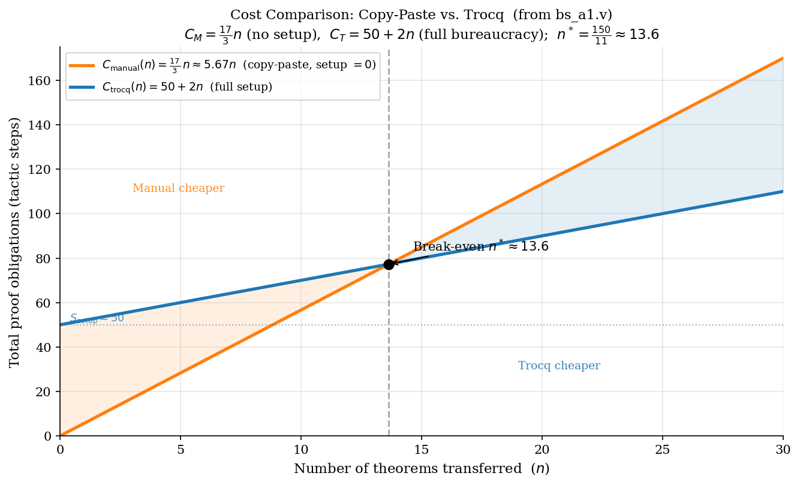
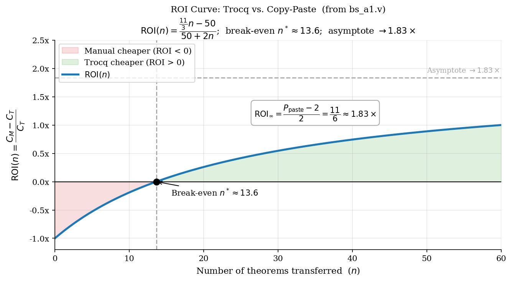

<!-- _class: title -->
<!-- _paginate: false -->

# ROI Analysis: Proof Transfer with Trocq

### When does automation beat copy-paste?

---

## The Experiment: `bs_a1.v`

We measure the **Return on Investment** of using Trocq to transfer theorems
between `NatList` and `PList nat`.

**Three phases in a single file:**

| Phase | Description | Role |
|-------|-------------|------|
| 1 | `NatList` definitions + base theorems | Source of truth |
| 2 | `PList nat` proofs by pure copy-paste | Manual baseline |
| 3 | Trocq proof transfer | Plugin approach |

**What we measure:** *proof obligations* — tactic steps required.

**Counting convention:**
- One period-terminated tactic = **1 step**
- `Trocq Use` commands = **1 step each**
- Bullet markers (`-`) = **0 steps**

> **Goal:** find the break-even point and understand *when* Trocq pays off.

---

<!-- _class: chapter -->
<!-- _paginate: false -->

# The Copy-Paste Baseline

*Phase 1 → Phase 2: rename and compile.*

---

## Phase 1 → Phase 2: Tactic-Identical Proofs

<div class="cols">

**Phase 1 — NatList (source)**
```coq
(* 5 tactic steps *)
Theorem nlength_napp :
  forall (l1 l2 : NatList),
  nlength (napp l1 l2) =
  nlength l1 + nlength l2.
Proof.
  intros l1 l2.
  induction l1 as [|h t IH]; simpl.
  - reflexivity.
  - rewrite IH. reflexivity.
Defined.
```

**Phase 2 — PList nat (copy-paste)**
```coq
(* 5 tactic steps — identical body *)
Theorem plength_papp_manual :
  forall (l1 l2 : PList nat),
  plength (papp l1 l2) =
  plength l1 + plength l2.
Proof.
  intros l1 l2.
  induction l1 as [|h t IH]; simpl.
  - reflexivity.
  - rewrite IH. reflexivity.
Defined.
```

</div>

**Key design choice:** `plength`, `papp`, `prev` are typed `PList nat -> ...`
(monomorphic), not `forall {A}, PList A -> ...`.
This makes every copied proof body **tactic-identical** — no `intros A`, no extra rewrites.

**Setup cost: 0.** Every new theorem is just a renamed copy.

---

## Phase 2 — Copy-Paste Costs

| Lemma / Theorem | Tactic steps |
|---|---|
| `papp_nil_r` (auxiliary) | 4 |
| `plength_papp_manual` | 5 |
| `papp_assoc_manual` | 5 |
| `prev_papp_manual` | 7 |
| **Fixed setup cost** | **0** |

$$P_{\text{paste}} = \frac{5 + 5 + 7}{3} = \frac{17}{3} \approx 5.67 \text{ steps/theorem}$$

$$C_{\text{manual}}(n) = n \cdot P_{\text{paste}} = \frac{17}{3}\,n \approx 5.67\,n \qquad \textbf{(no intercept)}$$

The manual cost line **starts at the origin** — no investment is needed before the first theorem.

---

<!-- _class: chapter -->
<!-- _paginate: false -->

# The Trocq Approach

*Phase 3: the full relational infrastructure.*

---

## Phase 3 — Infrastructure Breakdown

Before any theorem can be transferred, Trocq requires:

| Item | Tactic steps |
|---|---|
| `plist_nlist_iso` (forward iso) | 4 |
| `nlist_plist_iso` (backward iso) | 4 |
| `R_NatList` via `Iso.toParam` | 5 |
| Shared `Trocq Use` ×3 | 3 |
| **$S_{\text{bij}}$ subtotal** | **13** |
| `_plength`: bridge(5) + `R__`(5) + `Use`(1) | 11 |
| `_papp`: bridge(6) + `R__`(7) + `Use`(1) | 14 |
| `_prev`: bridge(6) + `R__`(5) + `Use`(1) | 12 |
| **Per-function subtotal** ($f = 3$) | **37** |
| **$S_{\text{setup}}$ total** | **50** |

This is a **one-time fixed cost** of 50 steps — paid before the first theorem.

---

## Phase 3 — Per-Theorem Cost

After the 50-step setup, each theorem costs exactly **2 tactic steps**:

```coq
Theorem _plength_papp : forall (l1 l2 : _PList),
    _plength (_papp l1 l2) = _plength l1 + _plength l2.
Proof. trocq. apply nlength_napp. Qed.   (* 2 steps *)

Theorem _papp_assoc : forall (l1 l2 l3 : _PList),
    _papp (_papp l1 l2) l3 = _papp l1 (_papp l2 l3).
Proof. trocq. apply napp_assoc. Qed.     (* 2 steps *)

Theorem _prev_papp : forall (l1 l2 : _PList),
    _prev (_papp l1 l2) = _papp (_prev l2) (_prev l1).
Proof. trocq. apply nrev_napp. Qed.      (* 2 steps *)
```

**Complexity-blind:** `_prev_papp` has 5 function applications in its statement,
yet costs the same 2 steps as `_plength_papp` which has 3.

$$C_{\text{trocq}}(n) = \underbrace{50}_{S_{\text{setup}}} + 2n$$

---

## Cost Formulas & Break-Even

$$C_{\text{manual}}(n) = \frac{17}{3}\,n \approx 5.67\,n \qquad C_{\text{trocq}}(n) = 50 + 2n$$

**Break-even** — set $C_{\text{manual}} = C_{\text{trocq}}$:

$$\frac{17}{3}\,n^* = 50 + 2n^*
\implies \frac{11}{3}\,n^* = 50
\implies n^* = \frac{150}{11} \approx 13.6$$

**From $n = 14$ onwards, Trocq is strictly cheaper.**

| $n$ | $C_{\text{manual}}$ | $C_{\text{trocq}}$ | Winner |
|-----|----|----|--------|
| 5  | 28  | 60  | Manual |
| 10 | 57  | 70  | Manual |
| 14 | 79  | 78  | **Trocq** |
| 20 | 113 | 90  | **Trocq** |
| 30 | 170 | 110 | **Trocq** |

---

## Cost Graph



The manual line starts at the **origin** (no setup). Trocq's intercept is **50**.
Break-even is at $n^* \approx 13.6$.

---

## ROI Formula & Long-Run

$$\text{ROI}(n) = \frac{C_{\text{manual}}(n) - C_{\text{trocq}}(n)}{C_{\text{trocq}}(n)} = \frac{\dfrac{11}{3}\,n - 50}{50 + 2n}$$

| Region | Interpretation |
|--------|----------------|
| ROI $< 0$ for $n < 13.6$ | Manual is cheaper — copy-paste not yet outpaced |
| ROI $= 0$ at $n \approx 14$ | Break-even point |
| ROI $\to 1.83\times$ as $n \to \infty$ | Trocq saves 1.83× its own cost |

**Long-run ROI** ($n \to \infty$):

$$\text{ROI}_{\infty} = \frac{P_{\text{paste}} - 2}{2} = \frac{17/3 - 2}{2} = \frac{11}{6} \approx 1.83\times$$

*$P_{\text{paste}}$ = avg. copy-paste tactic steps per theorem; $2$ = Trocq per-theorem cost.*

At scale, manual proof costs **2.83× as much** as Trocq per theorem —
a **bounded asymptote**, not exponential growth.

---

## ROI Curve



The curve starts at $-1$ ($n = 0$: Trocq costs 50, manual costs 0),
crosses zero at $n \approx 13.6$, then asymptotes to $1.83\times$.

---

## When Does Trocq Pay Off?

| Scenario | Winner | Key factor |
|---|---|---|
| Few theorems ($n < 14$), types similar | **Manual** | Copy-paste is free; 50-step setup not amortised |
| Many theorems ($n \geq 14$) | **Trocq** | Setup amortised; per-theorem cost only 2 steps |
| Types diverge structurally | **Trocq** | Copied scripts break; Trocq unaffected |
| Large vocabulary ($f \gg 3$), few theorems | **Manual** | $f \cdot W_{\text{trocq}}$ grows with no theorems to offset it |
| Massive library ($n \to \infty$) | **Trocq** | ROI $\to 1.83\times$ |

**Three tipping factors:**

1. **Volume** ($n \geq 14$): the 50-step setup only pays off across a large theorem library.
2. **Structural divergence**: if the two types have different induction schemes, copied proofs
   break and manual cost spikes; Trocq's 2-step per-theorem cost is unaffected.
3. **Vocabulary stability**: once `R__` wrappers are registered for $f$ functions, every future
   theorem costs exactly 2 steps regardless of syntactic complexity.

> Trocq's true competition is the pragmatic developer who copies a working proof
> and presses **F5**. That developer wins for $n < 14$. Trocq wins for large libraries.
