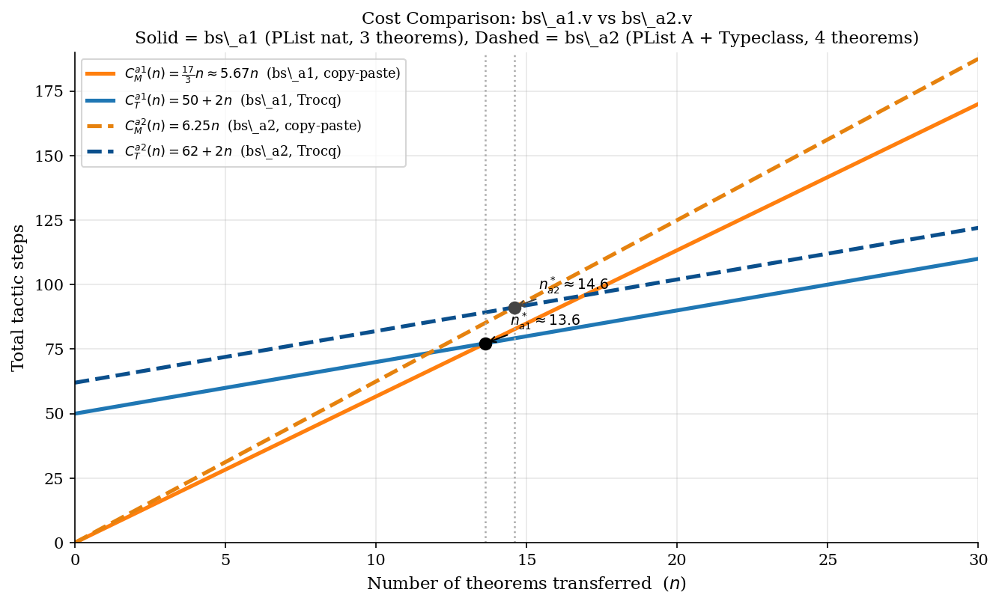
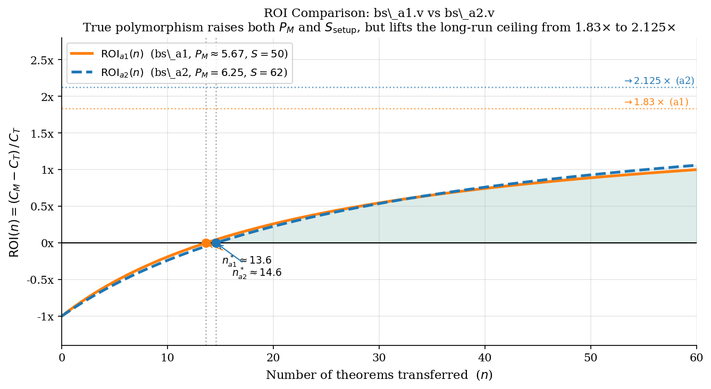

# ROI Analysis: Trocq vs Copy-Paste Proof Transfer

## Experiment: `bs_a1.v`

`bs_a1.v` is a self-contained Rocq experiment measuring the **Return on Investment**
of using the Trocq proof-transfer plugin against the most realistic manual
alternative: **copy-pasting proofs**.

Three phases in a single file:

| Phase | Description | Role |
|-------|-------------|------|
| 1 | `NatList` definitions + base theorems | Source of truth |
| 2 | `PList nat` proofs by pure copy-paste | Manual baseline |
| 3 | Trocq proof transfer | Plugin approach |

**Counting convention:** one period-terminated tactic = 1 step;
`Trocq Use` commands = 1 step each; bullet markers = 0 steps.

---

## 1. Variables

| Symbol | Meaning | Value in `bs_a1.v` |
|--------|---------|-------------------|
| $n$ | Number of theorems to transfer | 3 (measured) |
| $f$ | Number of distinct functions in the theory | 3 (`length`, `app`, `rev`) |
| $P_{\text{paste}}$ | Avg. tactic steps per copy-paste theorem | $17/3 \approx 5.67$ |
| $S_{\text{bij}}$ | One-time cost: iso proofs + type relation + shared registrations | 13 |
| $S_{\text{bridge}}$ | Bridge-lemma tactic cost per function | 5–6 |
| $W_{\text{trocq}}$ | Trocq overhead per function: `R__f` wrapper + `Trocq Use` | 6–8 |

---

## 2. Concrete Counts from `bs_a1.v`

### Phase 1 — NatList Base Theorems (source of truth)

| Lemma / Theorem | Tactic steps |
|---|---|
| `napp_nil_r` (auxiliary) | 4 |
| `nlength_napp` | 5 |
| `napp_assoc` | 5 |
| `nrev_napp` | 7 |
| **Total** | **21** |

### Phase 2 — Copy-Paste Manual (fixed setup = 0)

| Lemma / Theorem | Tactic steps |
|---|---|
| `papp_nil_r` (auxiliary) | 4 |
| `plength_papp_manual` | 5 |
| `papp_assoc_manual` | 5 |
| `prev_papp_manual` | 7 |
| **Fixed setup cost** | **0** |

The monomorphic design of `plength`, `papp`, `prev` (typed `PList nat -> ...`
rather than `forall {A}, PList A -> ...`) ensures every copied proof body is
**tactic-identical** to its NatList source — no extra `intros A`, no structural
rewrites. Copy, rename the type and constructor names, compile.

$$P_{\text{paste}} = \frac{5 + 5 + 7}{3} = \frac{17}{3} \approx 5.67 \text{ steps/theorem}$$

### Phase 3 — Trocq Infrastructure (full bureaucracy)

| Item | Tactic steps |
|---|---|
| `plist_nlist_iso` | 4 |
| `nlist_plist_iso` | 4 |
| `R_NatList` via `Iso.toParam` | 5 |
| Shared `Trocq Use` ×3 | 3 |
| **$S_{\text{bij}}$ subtotal** | **13** |
| `_plength`: bridge(5) + `R__`(5) + `Use`(1) | 11 |
| `_papp`: bridge(6) + `R__`(7) + `Use`(1) | 14 |
| `_prev`: bridge(6) + `R__`(5) + `Use`(1) | 12 |
| **Per-function subtotal** ($f = 3$) | **37** |
| **$S_{\text{setup}}$ total** | **50** |
| Per theorem ×3 (`trocq.` + `apply`) | 6 |

---

## 3. Cost Formulas

$$C_{\text{manual}}(n) = n \cdot P_{\text{paste}} = \frac{17}{3} \cdot n \approx 5.67 \cdot n$$

$$C_{\text{trocq}}(n) = \underbrace{S_{\text{bij}} + f \cdot (S_{\text{bridge}} + W_{\text{trocq}})}_{S_{\text{setup}} = 50} + n \cdot 2 = 50 + 2n$$

where $f = 3$, $S_{\text{bij}} = 13$, and $f \cdot (S_{\text{bridge}} + W_{\text{trocq}}) = 37$.

---

## 4. Break-Even Point

$$C_{\text{manual}}(n^*) = C_{\text{trocq}}(n^*)
\implies \frac{17}{3}\,n^* = 50 + 2n^*
\implies \frac{11}{3}\,n^* = 50
\implies n^* = \frac{150}{11} \approx 13.6$$

**Trocq becomes cheaper only from $n \geq 14$ theorems.**

---

## 5. ROI Formula

$$\text{ROI}(n) = \frac{C_{\text{manual}}(n) - C_{\text{trocq}}(n)}{C_{\text{trocq}}(n)} = \frac{\dfrac{11}{3}\,n - 50}{50 + 2n}$$

**Long-run ROI** ($n \to \infty$):

$$\text{ROI}_{\infty} = \frac{P_{\text{paste}} - 2}{2} = \frac{17/3 - 2}{2} = \frac{11}{6} \approx 1.83\times$$

At scale, manual proof costs 2.83× as much as Trocq per theorem — a bounded
asymptote, not exponential growth.

---

## 6. When Does Trocq Pay Off?

| Scenario | Winner | Key factor |
|---|---|---|
| Few theorems ($n < 14$), types similar | **Manual** | Copy-paste is free; 50-step setup not amortised |
| Many theorems ($n \geq 14$) | **Trocq** | Setup amortised; per-theorem cost only 2 steps |
| Types diverge structurally | **Trocq** | Copied proof scripts break; Trocq unaffected |
| Large vocabulary ($f \gg 3$), few theorems | **Manual** | $f \cdot W_{\text{trocq}}$ grows with no theorems to offset it |
| Massive library ($n \to \infty$) | **Trocq** | ROI $\to 1.83\times$ |

**Three tipping factors:**

1. **Volume** ($n \geq 14$): the 50-step setup is only amortised across a large theorem library.
2. **Structural divergence**: if `PList` and `NatList` had different induction schemes or
   constructor arities, copied proofs would fail and manual cost would spike; Trocq's
   per-theorem cost stays at 2.
3. **Vocabulary stability**: once `R__` wrappers are registered for all $f$ functions,
   every future theorem costs exactly 2 steps regardless of syntactic complexity.

> **Key lesson:** Trocq's true competition is the pragmatic developer who copies
> a working proof and presses F5. That developer wins for small libraries ($n < 14$).
> Trocq wins for large ones.

---

## 7. Experiment 2: `bs_a2.v` — True Polymorphism via Typeclasses

### What changed

`bs_a1.v` contained a deliberate **design cheat**: `plength`, `papp`, and `prev`
were typed `PList nat -> ...` (monomorphic), making copy-paste proofs
tactic-identical to their `NatList` sources. The professor's question exposed this:

> *"Since the list is polymorphic, how do you sum its elements? Who is the addition operator?"*

`bs_a2.v` fixes this by:

1. Making `plength`, `papp`, `prev` truly polymorphic: `forall {A : Type}, PList A -> ...`
2. Introducing a `Typeclass Addable A` (a minimal Monoid: `add`, `zero`, `add_assoc`, `add_zero_l`, `add_zero_r`)
3. Defining `psum` via `{H : Addable A}` — impossible without the Typeclass
4. Proving a fourth theorem: `psum_papp`

### New counts from `bs_a2.v`

#### Phase 3 (Manual) — where the cheat is exposed

| Lemma / Theorem | Steps | Copy-paste status |
|---|---|---|
| `papp_nil_r` (aux) | 4 | ✓ identical rename |
| `plength_papp_manual` | 5 | ✓ identical rename |
| `papp_assoc_manual` | 5 | ✓ identical rename |
| `prev_papp_manual` | 7 | ✓ identical rename |
| `psum_papp_manual` | **8** | ✗ 2 Typeclass divergences |
| **Fixed setup cost** | **0** | |

`psum_papp_manual` diverges in two places from the `NatList` proof:

| Step | `nsum_napp` (NatList) | `psum_papp_manual` (PList A) | Reason |
|---|---|---|---|
| Base case | `reflexivity` | `symmetry. apply add_zero_l` | `add zero x = x` is an axiom, not definitional |
| Inductive step | `rewrite IH. lia` | `rewrite IH. symmetry. apply add_assoc` | `lia` is ℕ/ℤ-only; abstract `A` needs explicit axiom |

$$P_{\text{paste}}^{a2} = \frac{5 + 5 + 7 + 8}{4} = 6.25 \text{ steps/theorem}$$

#### Phase 4+5 (Trocq) — infrastructure with the new `psum` wrapper

| Item | Steps |
|---|---|
| `plist_nlist_iso` + `nlist_plist_iso` + `R_NatList` | 13 |
| Shared `Trocq Use` ×3 | 3 |
| **$S_{\text{bij}}$ subtotal** | **13** |
| Bridge: `_plength`(5) + `_papp`(6) + `_prev`(6) + `_psum`(6) | 23 |
| `R__`: `_plength`(5) + `_papp`(7) + `_prev`(5) + `_psum`(5) | 22 |
| Per-function `Trocq Use` ×4 | 4 |
| **$S_{\text{setup}}^{a2}$ total** | **62** |
| Per theorem ×4 (`trocq.` + `apply`) | 8 |

The `R__psum` wrapper needed only **5 steps** — same as the structural wrappers — because `inst_addable_nat` makes `@add nat inst_addable_nat` definitionally equal to `Nat.add`, so the existing `Param_add` applies directly.

### Cost formulas

$$C_{\text{manual}}^{a2}(n) = 6.25\,n$$

$$C_{\text{trocq}}^{a2}(n) = 62 + 2n$$

### Break-even point

$$6.25\,n^* = 62 + 2n^* \implies 4.25\,n^* = 62 \implies n^* = \frac{62}{4.25} \approx 14.6$$

**Trocq becomes cheaper only from $n \geq 15$ theorems.**

### ROI formula and long-run asymptote

$$\text{ROI}^{a2}(n) = \frac{4.25\,n - 62}{62 + 2n}$$

$$\text{ROI}^{a2}_{\infty} = \frac{P_{\text{paste}}^{a2} - 2}{2} = \frac{6.25 - 2}{2} = \frac{4.25}{2} = 2.125\times$$

### Comparison: `bs_a1.v` vs `bs_a2.v`

| Metric | `bs_a1.v` | `bs_a2.v` | Δ |
|---|---|---|---|
| Theorems transferred ($n$ measured) | 3 | 4 | +1 |
| Functions ($f$) | 3 | 4 | +1 |
| $P_{\text{paste}}$ (steps/theorem) | $17/3 \approx 5.67$ | $6.25$ | +0.58 |
| $S_{\text{setup}}$ (one-time) | 50 | 62 | +12 |
| Break-even $n^*$ | $\approx 13.6$ | $\approx 14.6$ | +1 |
| $\text{ROI}_{\infty}$ | $\approx 1.83\times$ | $\approx 2.125\times$ | +0.3× |

The Typeclass abstraction raised the manual cost (+0.58 steps/theorem due to `psum` divergences) and the setup cost (+12 steps for the extra function). But both effects are small — the break-even shifted by only 1 theorem, while the long-run ROI ceiling improved by 0.3×.

